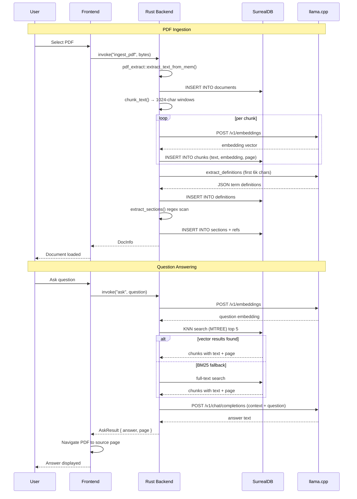

# Architecture

## System Overview

LexisLocal is a **local-first desktop application** built with **Tauri 2**, following a **two-process architecture** with a Rust backend and a React/TypeScript frontend. The application runs an embedded SurrealDB instance for storage with native vector search, and manages a llama.cpp sidecar process for local AI inference.

The architecture is **event-driven through Tauri's invoke system**: the frontend triggers commands on the Rust backend, which orchestrates PDF extraction, embedding, vector search, and LLM chat — all within the user's machine.

## System Diagram

```mermaid
graph TB
    subgraph "Frontend (React/TypeScript/Vite)"
        App[App.tsx<br/>State & Coordination]
        PdfViewer[PdfViewer<br/>PDF.js Canvas + Text Layer]
        FilePicker[FilePicker<br/>PDF File Upload]
        DocumentList[DocumentList<br/>Document Browser]
        ChatPanel[ChatPanel<br/>Question Input + Answers]
        InsightsPanel[InsightsPanel<br/>Definitions + Anomalies]
    end

    subgraph "Tauri Bridge"
        IPC[Tauri invoke<br/>Commands]
    end

    subgraph "Backend (Rust)"
        CMDS[commands.rs<br/>Command Handlers]
        AI[ai.rs<br/>LLM Client + Chunking]
        DB[db.rs<br/>Database Init + Schema]
        EXTRACT[extractor.rs<br/>(reserved)]
    end

    subgraph "Sidecar"
        LLAMA[llama-server<br/>OpenAI-compatible API]
        MODEL[GGUF Model<br/>nomic-embed-text-v1.5]
    end

    subgraph "Storage"
        SURREAL[SurrealDB<br/>SurrealKv engine]
        DOCS[(documents)]
        CHUNKS[(chunks<br/>+ MTREE index)]
        DEFS[(definitions)]
        SECTIONS[(sections)]
        REFS[(refs)]
    end

    App -->|File selected| FilePicker
    App -->|Document list| DocumentList
    App -->|Question| ChatPanel
    App -->|Definitions/Anomalies| InsightsPanel
    App -->|PDF rendering| PdfViewer

    FilePicker -->|invoke ingest_pdf| CMDS
    ChatPanel -->|invoke ask| CMDS
    InsightsPanel -->|invoke list_definitions| CMDS
    InsightsPanel -->|invoke detect_anomalies| CMDS
    DocumentList -->|invoke list_documents| CMDS

    CMDS -->|extract text| EXTRACT
    CMDS -->|read/write| SURREAL
    CMDS -->|embed + chat| AI
    AI -->|HTTP /v1/*| LLAMA
    LLAMA -->|load| MODEL

    SURREAL --> DOCS
    SURREAL --> CHUNKS
    SURREAL --> DEFS
    SURREAL --> SECTIONS
    SURREAL --> REFS
```

## Data Flow



## Directory Structure

```
lexis-local/
├── src/                              # React frontend
│   ├── App.tsx                       # Root component, owns all state
│   ├── main.tsx                      # React entry point
│   ├── globals.css                   # Tailwind + PDF.js text layer styles
│   ├── components/
│   │   ├── PdfViewer.tsx             # PDF.js canvas + text overlay + hover cards
│   │   ├── FilePicker.tsx            # Hidden <input> for .pdf selection
│   │   ├── DocumentList.tsx          # Sidebar document browser
│   │   ├── ChatPanel.tsx             # RAG question-answer panel
│   │   └── InsightsPanel.tsx         # Definitions + anomaly checking
│   └── hooks/
│       └── useTauriCommand.ts        # Thin invoke wrapper
├── src-tauri/                        # Rust backend
│   ├── Cargo.toml                    # Rust dependencies
│   ├── tauri.conf.json               # Tauri app configuration
│   ├── src/
│   │   ├── main.rs                   # Binary entry point
│   │   ├── lib.rs                    # Tauri builder + sidecar lifecycle
│   │   ├── commands.rs               # All Tauri command handlers
│   │   ├── db.rs                     # SurrealDB init + schema
│   │   ├── ai.rs                     # LLM client, chunking, sections
│   │   └── extractor.rs              # Reserved for future extraction
│   ├── tests/
│   │   └── sidecar.rs                # Sidecar process lifecycle test
│   └── icons/                        # App icons (all sizes)
├── public/                           # Static assets (logos)
├── docs/                             # Generated documentation
├── plan.md                           # Phased build plan
├── CLAUDE.md                         # Agent guide + constraints
├── AGENTS.md                         # Agent configuration
├── vite.config.ts                    # Vite + Tailwind config
└── package.json                      # npm dependencies
```

## Key Design Decisions

- **Embedded database**: SurrealDB with SurrealKv engine (RocksDB-based) — no separate DB process, zero configuration.
- **Sidecar pattern**: llama.cpp runs as a child process managed by Tauri's shell plugin, auto-spawned on boot and killed on exit.
- **Chunking strategy**: 1024-character windows with 128-character overlap. Each chunk tagged with its source page for navigation.
- **Dual retrieval**: Vector search (M-TREE index, 768-dim embeddings) with BM25 full-text fallback when embedding similarity yields no results.
- **Best-effort extraction**: Definition extraction, section parsing, and anomaly detection are non-blocking — failures produce empty results rather than errors.
- **Ponytail shortcuts**: Several deliberately simple heuristics (first-occurrence-is-heading for sections, 6k-char cap on definition extraction) are marked with `// ponytail:` comments and documented upgrade paths.
